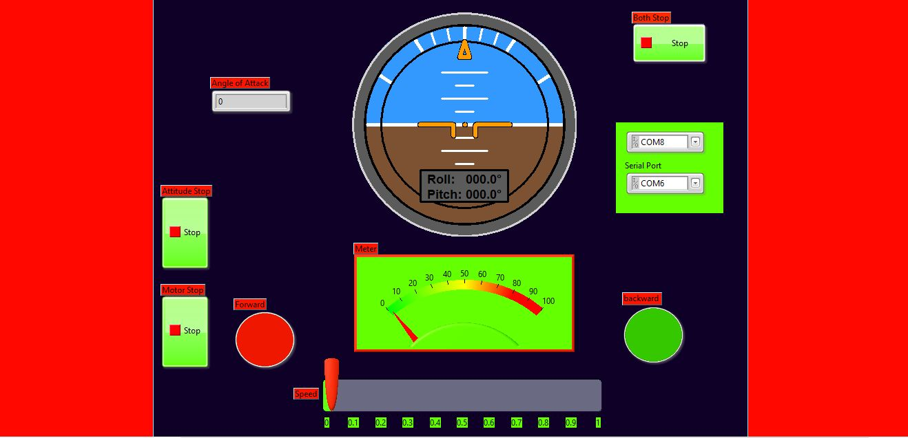

# 🚀 SubMarineMotionController

### 🎯 Project Description

**SubMarineMotionController** is a custom-built Arduino system designed by **Lakshan Lavan** to monitor and simulate submarine-like behavior using an **MPU-6050 IMU sensor**, **Kalman filtering**, and **Modbus-controlled DC motors**. The system outputs real-time roll, pitch, and yaw data over serial and allows motor control via external interfaces like **LabVIEW** or SCADA software.

---

## 🎛️ LabVIEW Interface

This project includes a fully interactive LabVIEW UI to visualize submarine attitude and control propulsion:



---

## 🛠️ System Overview

- 📌 Platform: **Arduino Uno**
- 🎯 Sensors: **MPU-6050** (Accelerometer + Gyroscope)
- ⚙️ Motor Driver: **L298N Dual H-Bridge**
- 📡 Communication: **Modbus RTU (via Serial)**
- 📈 Visualization: Compatible with **LabVIEW UI**
- 🧠 Filtering: **Complementary + Kalman Filters** for orientation stability

---

## 🧩 Features

✅ Reads 3-axis accelerometer and gyroscope data  
✅ Computes orientation using Kalman filter  
✅ Transmits data as structured serial frames  
✅ Accepts Modbus RTU commands for motor control  
✅ Colorful LabVIEW visualization compatible  

---

## 🧰 Hardware Used

| Component            | Function                              |
|---------------------|----------------------------------------|
| Arduino Uno          | Main microcontroller board            |
| MPU-6050 IMU         | Motion sensing (roll, pitch, yaw)     |
| L298N Motor Driver   | Motor interface for directional drive |
| DC Motor             | Acts as propeller/actuator            |
| Serial Connection    | Modbus RTU link (via USB)             |

---

## 📊 Output Format (Serial)

The code sends formatted sensor data over serial every 5ms:

```
DEL:<dt>#ACC:<ax>,<ay>,<az>#GYR:<gx>,<gy>,<gz>#FIL:<fx>,<fy>,<fz>#KAL:<kx>,<ky>,<kz>
```

### 📘 Tag Descriptions

| Tag   | Description                                    |
|--------|------------------------------------------------|
| `DEL`  | Loop execution time in milliseconds (`dt`)     |
| `ACC`  | Accelerometer-based angles (°) from MPU-6050   |
| `GYR`  | Gyroscope-integrated angles (°/s)              |
| `FIL`  | Complementary filter output angles (°)         |
| `KAL`  | Kalman filter output angles (°)                |

### 📌 Example Output

```
DEL:5#ACC:3.12,1.47,-9.02#GYR:0.14,-0.06,0.02#FIL:3.08,1.40,-9.10#KAL:3.09,1.42,-9.08
```

---

## 🔄 Modbus Register Map

| Register | Function        | Type   |
|----------|------------------|--------|
| 40001    | Motor Speed (0–255) | Write  |
| 40002    | Motor Direction (`0=Reverse`, `1=Forward`) | Write  |

---
